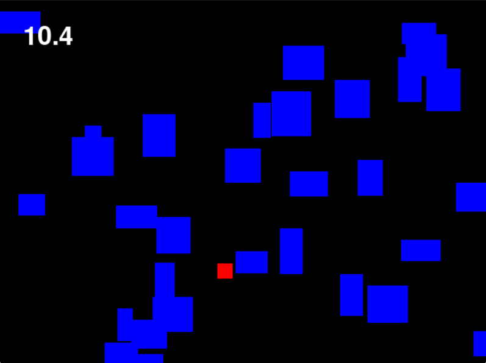

# pygame-dodge-game
Pygameで小さな避けゲーを作り、制作テンプレート化を目指す学習用プロジェクトです。


1. Python 3.13.9 をインストール

2. このリポジトリをクローン

```bash
git clone https://github.com/dev-haku/py-gamekit.git
cd py-gamekit
```

3. 依存関係ライブラリのインストール

```bash
python -3.13 -m pip install -r requirements.txt
```

4. プロジェクトのフォルダを開く
5. ターミナル（コマンドプロンプト）を開く
6. 起動ファイルの実行

```bash
python run.py
```

## Screenshot
