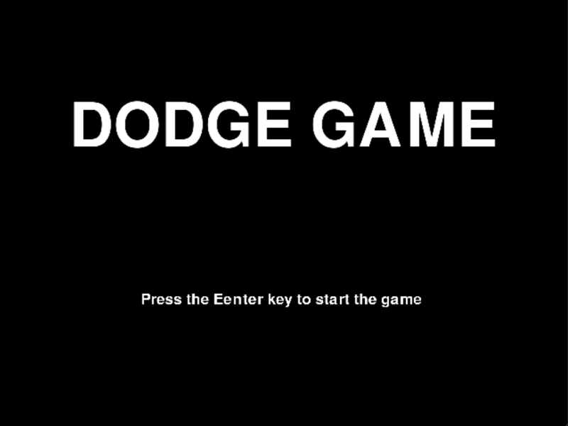
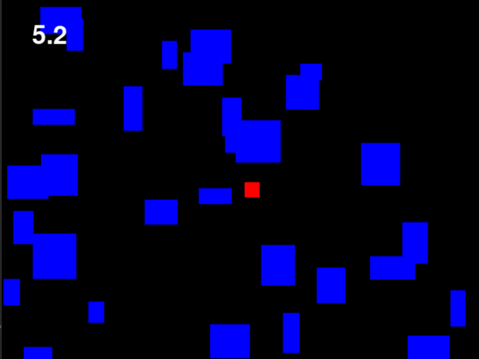
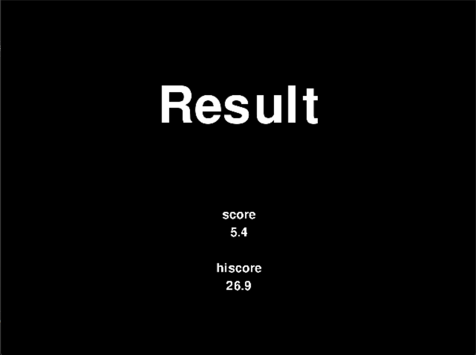

# pygame-dodge-game

Pygameで小さな避けゲーを作り、制作テンプレート化を目指す学習用プロジェクトです。

## How to Play


1. Python 3.13.9 をインストール

2. リポジトリをクローン

   ```bash
   git clone -b feature/v0.3 https://github.com/tenkaLab/pygame-dodge-game.git
   ```

3. ディレクトリに移動

   ```bash
   cd pygame-dodge-game
   ```

4. 依存関係ライブラリをインストール

   ```bash
   py -3.13 -m pip install -r requirements.txt

   ```

5. 特定のプロトタイプのディレクトリに移動

   ```bash
   cd <directory_name>

   # 例
   cd game-dash-function
   ```

6. ゲームを起動

   ```bash
   py -3.13 main.py
   ```

## Screenshot
  